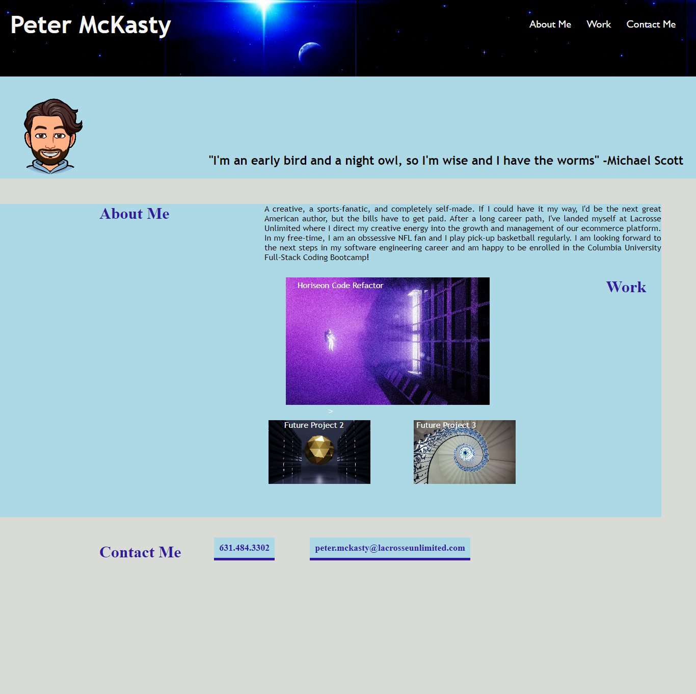

# my-portfolio

## Description

This is the initial copy of my professional portfolio which will develop and progress as the Columbia University full-stack coding bootcamp continues. Here, you can learn a little bit about me, access my work and find ways to contact me.

### List of Features 

1. The navigation section will direct you to the correct sections of the page when clicked.
2. The About Me section gives a brief excerpt about my professional career and personal interests.
3. The Work section provides links directed to my work. The only functional link right now is the Horiseon Code Refactor since that is the only project completed at this time.
4. In the Contact section you will find various ways to contact me. 
5. Eventually, when you view this on mobile and various sized screens, the elements will react and adjust based on screen sized. Right now, I was not technically skilled enough to figure it out. 

### Usage

This Portfolio will eventually be used to provide employer information about myself and to showcase my work. This is an early concept, and will be much more dynamic and aesthetically appealing as my abilities improve. 

### Preview

The following image shows a preview of my portfolio:

